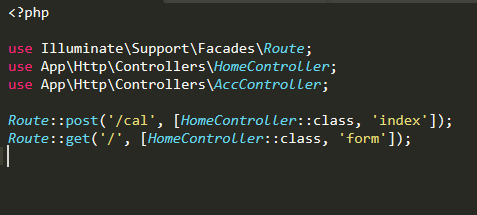
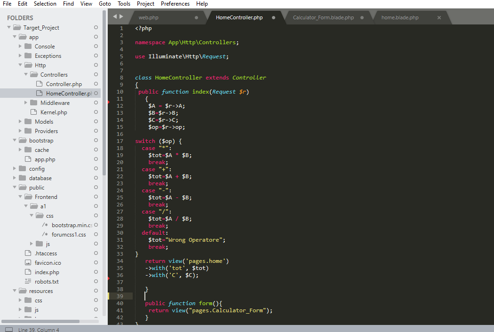
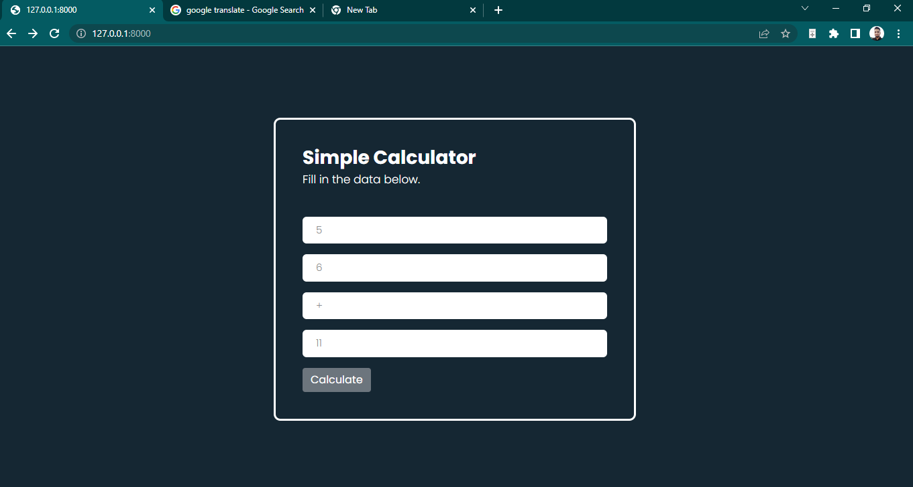
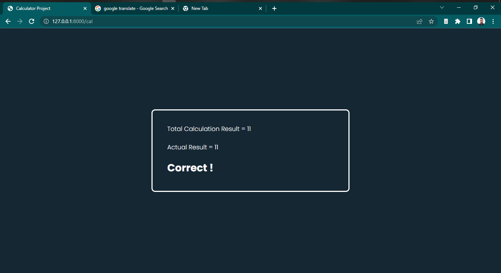
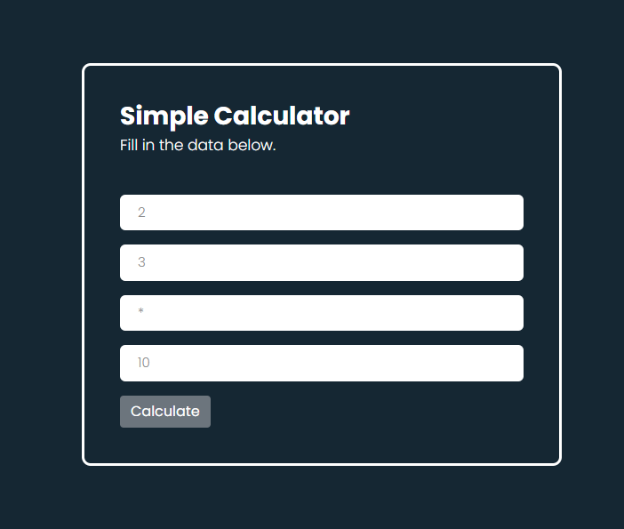
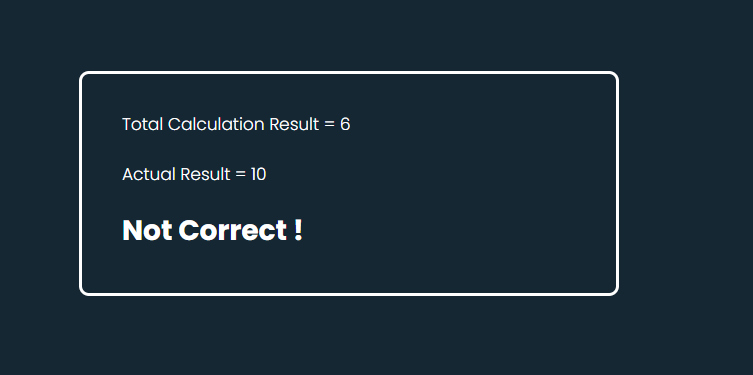

# Project Details
I have made a simple Laravel project of two pages. The following image shows the web route of the Laravel project.

I have created two functions inside HomeController. The user will enter the default page through a function. And another function will calculate the user's data.

-These calculation data have been transferred to the home page. The following image shows the home page UI.

-And the result is the output page.

###And another example is given below.

# Author

[Omar Faruk](https://www.linkedin.com/in/omar-f-basit/)

# Installation
- Clone your project
- Go to the folder application using cd command on your cmd or terminal
- Run composer install on your cmd or terminal
- Copy .env.example file to .env on the root folder. You can type copy .env.example .env if using command prompt Windows or cp .env.example .env if using terminal, Ubuntu
Open your .env file and change the database name (DB_DATABASE) to whatever you have, username (DB_USERNAME) and password (DB_PASSWORD) field correspond to your configuration.

- Run php artisan key:generate
- Run php artisan migrate
- Run php artisan serve
- Go to http://localhost:8000/